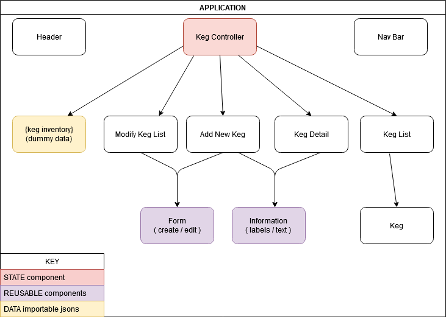

# _[ %(unnamed) Tap Room% ]_  

## _A React Application_

### _February 12th, 2021_  
----------------------
## Description:

This website is a React-built application allowing a user to view the draft menu of a tap room. The user plays the part of the business owner, and so is given granted permission to add new brews on tap, to sell units of each until stock runs out, as well as edit existing brews and delete any as desired.

The application is structured as pictured below:

(Text description for this image will be provided at a later date).
----------------------
## Project Criteria:  

As referenced from the [Epicodus](https://epicodus.com) program's curriculum:  

> \[Build\] a tap room in React where a bar \[...\] can track their kegs. \[...\]
>
> Before getting started, plan out your application and draw a component tree or component diagram that shows the structure of your components. \[...\]
>
> Here are some user stories to get you started. The application should have the following functionality:
>
> - As a user, I want to see a list/menu of all available kegs. For each keg, I want to see its name, brand, price and alcoholContent \[...\].
> - As a user, I want to submit a form to add a new keg to a list.
> - As a user, I want to be able to click on a keg to see its detail page.
> - As a user, I want to see how many pints are left in a keg. Hint: A full keg has roughly 124 pints.
> - As a user, I want to be able to click a button next to a keg whenever I sell a pint of it. This should decrease the number of pints left by 1. Pints should not be able to go below 0.

-------------------------------
## Known Issues / Current Bugs:
- None known
-------------------------------
## Bug log:
- Used the wrong declaration in the `<label>` tags. Fixed.
-------------------------------
## Setup:

### Prior to downloading:
> Each of the following programs and softwares will be listed with the version numbers used in making this application. While you may not need to have these _specific_ versions installed, compatibility cannot be guaranteed with earlier or later releases.
>
> You will need to have the following installed and set up on your local machine before you will be able to utilize this program:
- [node.js](https://nodejs.org/en/)

For more step-by-step instructions on installation, please visit [this Epicodus tutorials](https://www.learnhowtoprogram.com/intermediate-javascript/getting-started-with-javascript/installing-node-js).

----------------------
### To view locally on your machine / download from browser:  

1. Find the green **Code** button above the file list on this project's [main GitHub repository page](https://github.com/grand-scheme/taproom).

2. Select the button to open a drop-down menu. Select "Open with GitHub Desktop" or, if you do not have this program installed, download the compressed .zip file.

3. Extract the .zip file to your local machine.

4. Directions were accurate as this project's latest update. If GitHub has since changed their protocol, please see [the GitHub help docs](https://docs.github.com/en) for up-to-date information.

----------------------
### To clone this project to your machine: 
> The following directions are based on Git Bash for a Windows machine; you may have to adjust terminology based on your local specs.
1. Launch your terminal of choice. 

2. Navigate to the containing directory into which you would like to clone this project.

3. Input:\
`$ git clone https://github.com/grand-scheme/taproom`

4. This will clone the project to a folder called "taproom." If you wish to clone it into a directory of a different name, append the new folder name to the end of the string, like so:\
`$ git clone https://github.com/grand-scheme/taproom NEW-FOLDER`\
where `NEW-FOLDER` is where you would type the name of the folder you would like to use.\
**Note:** It is highly recommended that your destination folder retains the name `taproom`. It is recommended not to use special characters in your file name paths. 

5. Directions were accurate as this project's latest update. If GitHub has since changed their protocol, please see [the GitHub help docs](https://docs.github.com/en) for up-to-date information.

----------------------
## To run this project on your machine:
 
1. Once you have the project locally stored, navigate to its main directory in your terminal of choice. By default, this is `taproom`.

2. In your command line, input as separate commands:\
`$ npm install`\
`$ npm run build`\
`$ npm start`

3. Be patient! `npm install` can take some time to finish.

4. If all goes well, the command terminal should inform you that a local host has been launched for this program at `http://localhost:3000`. 

-------------------------------
-------------------------------
## Technologies Used:  
- Visual Studio Code
- node.js
- React
-------------------------------
## License
- _GNU AGPLv3_  
- Project copyright (c) 2021 **_Shannon Grantski_**  
- Project criteria quoted text copyright (c) 2021 Epicodus, Inc.